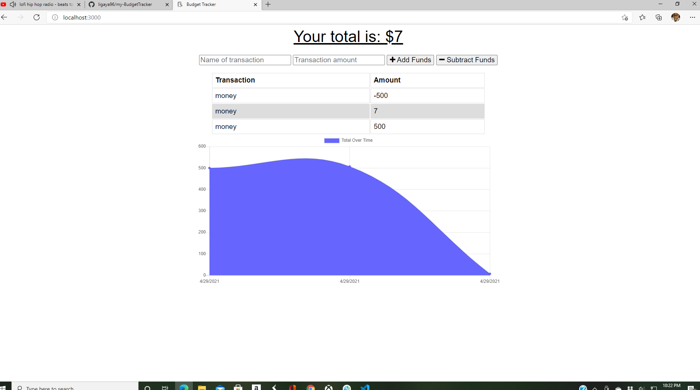

# my-BudgetTracker

# Description 
this App will allow the user to track their budget online as well as offline. When adding transcation offline, budget will then populate online. 

# Installation 
<ul> 
<li> Express </li>
<li> MongoDB </li>
<li> Mongoose </li>
</ul>

# Heroku Link 
<a href="https://infinite-ridge-91935.herokuapp.com/">Visit My Budget Tracker!</a>

# ScreenShot 
